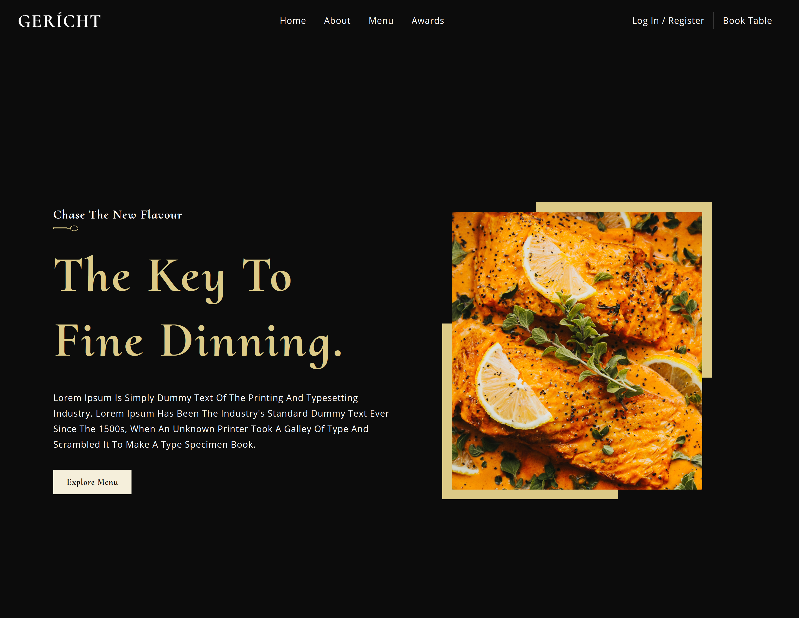
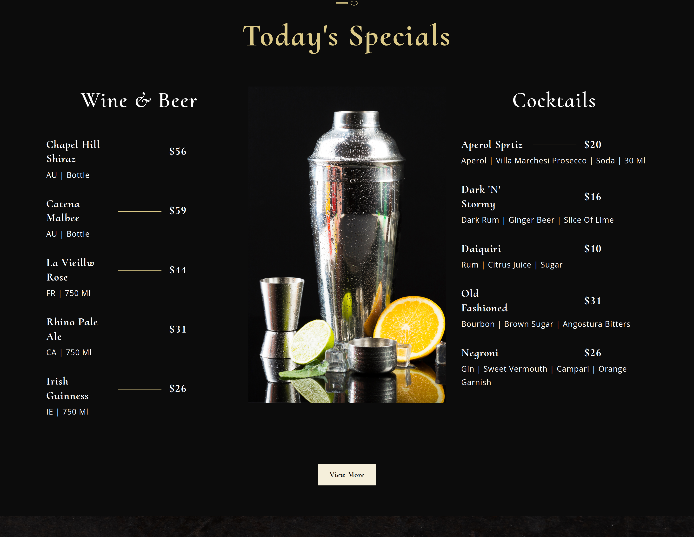

# Modern UI/UX Restaurant website

A modern and fully responsive restaurant website created using React.js. The inspiration for this design was taken from [This UI8 design template](https://ui8.net/iqonicdesign/products/gericht-restaurant-website-ui-in-figma).

## Technologies used:

- [React](https://reactjs.org/)
- [React hooks](https://reactjs.org/docs/hooks-intro.html);
- [React-icons](https://react-icons.netlify.com/)
- [BEM-CSS](https://en.bem.info/)
- [Netlify](https://www.netlify.com/)

## Livesite URL:

[Live site deployed on Netlify](https://modern-restaurant-react.netlify.app/)

## Things that can be improvd:

- The introductory video and background images can be improved to be rendered faster by using Cloudinary.

## Screenshots:

